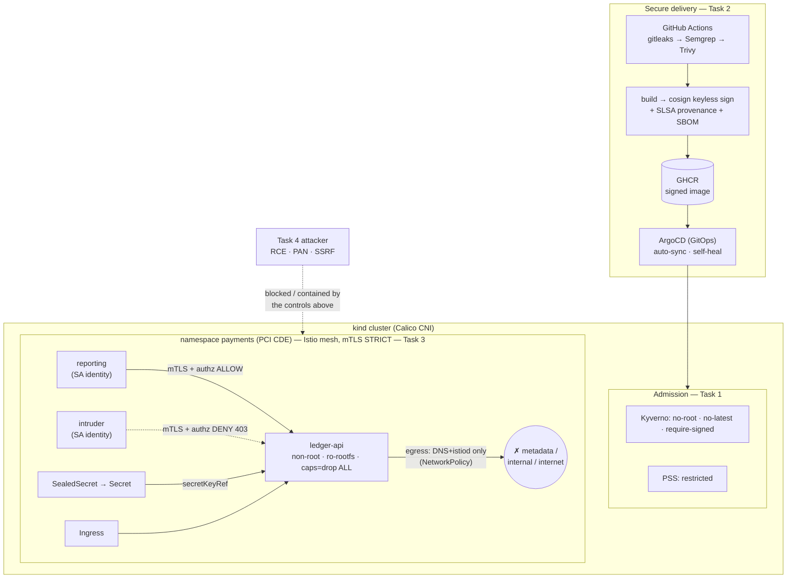

# Dodo Payments — Security & DevOps Engineer Assessment

Harden the `ledger-api` payments microservice end-to-end — **workload
hardening → secure delivery → zero-trust networking** — then **attack it** and
prove the controls hold.

> **The through-line:** the *same* service is hardened in Tasks 1–3 and attacked
> in Task 4. Every Task-4 finding maps back to the exact control from Tasks 1–3
> that prevents, gates, or contains it (Task 4 report §7). Defence-in-depth is
> the theme; each control is demonstrated *enforcing*, not just present.

Everything runs **locally and free**: `kind` + Calico + Istio + GitHub Actions +
GHCR. No cloud account required.

---

## Repository map

| Task | Folder | What's proven |
|------|--------|---------------|
| **1 — Deploy & Harden** | [`task1-harden-workload/`](task1-harden-workload) | non-root + read-only + drop-ALL-caps + seccomp; dedicated least-priv SA (no token/RBAC); **Sealed Secrets** (no plaintext in git); **Kyverno + PSS restricted** reject the insecure Deployment; persona RBAC |
| **2 — Secure CI/CD** | [`task2-cicd-supply-chain/`](task2-cicd-supply-chain) | GH Actions: gitleaks → Semgrep → Trivy → build → image-scan → push → **cosign keyless sign + SLSA provenance + SBOM** → verify; SARIF to Security tab; **ArgoCD** GitOps drift self-heal; documented fail policy; local scan evidence (gates fail the vulnerable app, pass the hardened one) |
| **3 — Zero-Trust Mesh** | [`task3-istio-zero-trust/`](task3-istio-zero-trust) | Istio **mTLS STRICT** (plaintext refused); **default-deny AuthorizationPolicy** + identity allow (reporting=200, intruder=403); **Calico NetworkPolicy** egress containment → SSRF blast-radius = 0 |
| **4 — Recon & Pentest** | [`task4-recon-pentest/`](task4-recon-pentest) · [**report**](task4-recon-pentest/report/Dodo-Payments-Security-Assessment.md) | passive OSINT of `dodopayments.tech` (112 subdomains, exposed admin consoles); black-box pentest of local `ledger-api` — **RCE(9.8)/PAN/SSRF** chained to secret exfil, CVSS + PoC + retest |

The hardened application is in [`app/`](app); the original vulnerable app is
preserved at [`task4-recon-pentest/pentest/target/`](task4-recon-pentest/pentest/target) as the authorized test target.

---

## Architecture



**Layered controls (defence-in-depth):**
- **Admission** (Kyverno + PSS) — rejects root/`:latest`/unsigned before scheduling.
- **Workload** (securityContext, least-priv SA, Sealed Secrets) — minimises blast radius.
- **Supply chain** (scan-gate + keyless signature) — only vetted, signed images run.
- **Mesh** (mTLS + identity authz) — encrypted, identity-based, default-deny.
- **Network** (Calico NetworkPolicy) — kernel-level floor + egress containment.

---

## Quick start

```bash
# one command: cluster + Calico + Sealed Secrets + Kyverno + ingress + Istio +
# build/deploy the hardened workload + zero-trust policies
./scripts/bootstrap.sh

# verify each task
./task1-harden-workload/verify.sh      # hardening + admission + RBAC
./task3-istio-zero-trust/verify.sh     # mTLS + identity authz + NetworkPolicy

# Task 2 GitOps drift demo (after ArgoCD is registered)
./task2-cicd-supply-chain/argocd/setup.sh && ./task2-cicd-supply-chain/drift-demo.sh
```

…or use the **[`Makefile`](Makefile)** for one-command UX:

```bash
make bootstrap     # full stack        make verify    # all verification suites
make demo-canary   # canary 90/10→50/50  make demo-drift  # ArgoCD self-heal
make pentest       # run the vuln target  make retest    # prove findings closed
make clean         # tear it all down
```

**Tooling:** kind, kubectl, helm, docker, Calico, Istio (+CNI), Kyverno,
Sealed Secrets, ArgoCD, cosign, trivy, gitleaks, semgrep. Cluster config:
[`task1-harden-workload/cluster/kind-config.yaml`](task1-harden-workload/cluster/kind-config.yaml).

## Security artifacts (defender's view)

- 🧭 **[Threat model (STRIDE)](docs/THREAT-MODEL.md)** — threats → controls → residual risk for the CDE
- 📋 **[PCI DSS v4.0 control mapping](docs/PCI-DSS-MAPPING.md)** — audit-ready control ↔ requirement matrix
- 🗺️ **[Evidence & requirements traceability](#evidence--requirements-traceability)** — verify every requirement in 2 minutes (below)

---

## Notable engineering decisions

- **Fixed the app, not just the deployment.** Shipping a known-RCE payments
  service while calling it "production-grade" is indefensible, so `app/` fixes
  the code (`safe_load`, SSRF guard, auth + PAN masking, current deps) *and* the
  platform hardens around it.
- **Istio CNI plugin** so injected sidecars satisfy **PSS restricted** (the
  default `NET_ADMIN` init container would be rejected).
- **Calico**, because kind's default `kindnet` doesn't enforce NetworkPolicy —
  the segmentation had to *actually enforce*, and it's proven doing so.
- **Guardrails scoped to workload namespaces**, excluding platform namespaces
  (CNI/mesh/controllers legitimately need privilege) — learned by watching my
  own policy correctly block the Istio CNI DaemonSet.
- **Honest SAST triage:** the hardened `/fetch` still trips Semgrep's generic
  SSRF taint rule; it's suppressed *in source with a dated justification* and a
  compensating egress NetworkPolicy — visible in SARIF as `suppressed`, not hidden.

---

## Live proofs

Local proofs (cluster enforcement, scan gates, mesh policies, pentest PoCs) are
captured in each task's `PROOF.txt` / `evidence/`. The GitHub-hosted proofs are live:

- **CI pipeline (green):** https://github.com/yasheela-alla/dodo-payments-devsecops/actions
- **Signed image (GHCR):** https://github.com/yasheela-alla/dodo-payments-devsecops/pkgs/container/ledger-api
- **`cosign verify`** (workflow OIDC identity + Rekor): [`task2-cicd-supply-chain/proof/cosign-verify.txt`](task2-cicd-supply-chain/proof/cosign-verify.txt)
- **SARIF in Security tab:** `semgrep`, `trivy-deps`, `trivy-image`
- **ArgoCD drift → self-heal:** [`task2-cicd-supply-chain/argocd/DRIFT-SELFHEAL-PROOF.txt`](task2-cicd-supply-chain/argocd/DRIFT-SELFHEAL-PROOF.txt)
- **Closed supply-chain loop** — CI signs → promotes digest to git → ArgoCD deploys → **Kyverno verifies the signature at admission** (unsigned rejected): [`task2-cicd-supply-chain/proof/SIGNED-IMAGE-ADMISSION-PROOF.txt`](task2-cicd-supply-chain/proof/SIGNED-IMAGE-ADMISSION-PROOF.txt)
- **Live canary** (VirtualService/DestinationRule weighted routing, 90/10→50/50): [`task3-istio-zero-trust/canary/CANARY-PROOF.txt`](task3-istio-zero-trust/canary/CANARY-PROOF.txt)
- **Pentest report** also as [HTML](task4-recon-pentest/report/Dodo-Payments-Security-Assessment.html) / [PDF](task4-recon-pentest/report/Dodo-Payments-Security-Assessment.pdf)
- **Terminal recordings (GIFs)** of every live demo: [`docs/recordings/`](docs/recordings) — hardening, zero-trust, supply-chain, pentest+retest
- **UI screenshots** (GitHub Actions/Security, ArgoCD, OrbStack): [`docs/screenshots/`](docs/screenshots)

---

## Evidence & requirements traceability

Every item the brief asks for, and exactly where it's proven:

| Task | Requirement | Proven by |
|------|-------------|-----------|
| 1 | neighbour + Deploy/Svc/ConfigMap/Ingress | [`task1/manifests/`](task1-harden-workload/manifests) |
| 1 | non-root · read-only · drop-ALL · seccomp | `task1` `PROOF.txt` · [demo GIF](docs/recordings/task1-hardening.gif) |
| 1 | resources + probes on every container | [`30-deployment.yaml`](task1-harden-workload/manifests/30-deployment.yaml) |
| 1 | least-priv SA (no default) + RBAC | [`20-serviceaccount.yaml`](task1-harden-workload/manifests/20-serviceaccount.yaml) · `RBAC-MATRIX.txt` |
| 1 | secrets out of git (Sealed Secrets) | [`40-sealed-secret.yaml`](task1-harden-workload/manifests/40-sealed-secret.yaml) |
| 1 | Kyverno reject root/`:latest`/unsigned | [`policies/`](task1-harden-workload/policies) · `REJECTION-OUTPUT.txt` |
| 1 · bonus | persona RBAC · PSS restricted · reject original | `rbac-personas/` · `00-namespace.yaml` · `insecure-original/` |
| 2 | GH Actions build/scan/sign/deploy | [`ci.yml`](.github/workflows/ci.yml) · [run](https://github.com/yasheela-alla/dodo-payments-devsecops/actions) |
| 2 | Semgrep · Trivy · image-scan · gitleaks | `scan-evidence/` + Security tab SARIF |
| 2 | cosign keyless + SLSA + fail policy | `proof/cosign-verify.txt` · [Task 2 README](task2-cicd-supply-chain) |
| 2 | ArgoCD GitOps drift + self-heal | `argocd/DRIFT-SELFHEAL-PROOF.txt` |
| 2 · bonus | SARIF · `cosign verify` · canary | Security tab · `proof/` · `canary/CANARY-PROOF.txt` |
| 3 | Istio mTLS STRICT + plaintext refused | `task3` `PROOF.txt` · [demo GIF](docs/recordings/task3-zerotrust.gif) |
| 3 | default-deny authz by identity (allow/deny) | reporting=200 / intruder=403 in `PROOF.txt` |
| 3 | cert issuance/rotation + trust root explained | [Task 3 README](task3-istio-zero-trust) |
| 3 | NetworkPolicy + layer explanation | [`30-networkpolicy.yaml`](task3-istio-zero-trust/manifests/30-networkpolicy.yaml) |
| 3 · bonus | ingress gateway TLS · canary · CDE tie-in | `gateway/` · `canary/` · Task 3 + PCI mapping |
| 4A | passive recon (CT/DNS/TLS/banners) | [`recon/`](task4-recon-pentest/recon) + report §3 |
| 4B | OWASP pentest, CVSS, PoC, remediation | [report](task4-recon-pentest/report/Dodo-Payments-Security-Assessment.md) + `pentest/evidence/` |
| 4 · bonus | chain findings · retest · map to defences | report §5–§7 · [retest GIF](docs/recordings/pentest.gif) |
| extra | threat model · PCI mapping · Makefile | [`THREAT-MODEL.md`](docs/THREAT-MODEL.md) · [`PCI-DSS-MAPPING.md`](docs/PCI-DSS-MAPPING.md) · [`Makefile`](Makefile) |

## What I'd do with more time (production roadmap)

Everything above runs and is proven; these are the next steps to take it from a
faithful local demo to production:
- **Secrets:** External Secrets + Vault (or SOPS+age with an ArgoCD decryptor) and
  KMS **encryption-at-rest** for etcd — beyond "no plaintext in git."
- **Supply chain:** enforce **signed git commits** + branch protection; pin every
  base image by digest; add `grype` as a second scanner and a VEX feed to suppress
  non-exploitable CVEs precisely.
- **Runtime:** **Falco** for runtime threat detection; gVisor/Kata for stronger
  isolation of the CDE; an Istio local-rate-limit + HPA for DoS resilience.
- **Observability/audit:** enable K8s **API audit logging** → SIEM; Prometheus/Grafana
  SLOs; alert on Kyverno denials and mTLS failures.
- **Mesh:** chain istiod to a `cert-manager` intermediate CA (real trust root);
  progressive delivery via Argo Rollouts with automated canary analysis.
