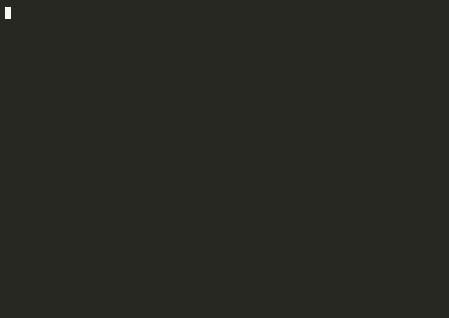

# Terminal recordings (proof it works)

Headless recordings of the live demos (`asciinema` → `agg` GIF). Each `.sh`
here re-runs the exact commands against the running cluster; the `.cast` is the
raw recording and the `.gif` renders inline on GitHub.

**Whole stack live (proof it's really running):**

| Demo | GIF | Shows |
|------|-----|-------|
| **Live stack** |  | timestamped tour: OrbStack hosting the kind nodes, all pods 2/2, the **signed** GHCR image running, ArgoCD Synced/Healthy, Kyverno policies, mesh registered |
| Task 1 — hardening |  | locked securityContext, least-priv RBAC (no secret access), admission **rejecting** the insecure Deployment |
| Task 3 — zero-trust |  | mTLS **STRICT**, authz **200 (reporting) vs 403 (intruder)**, NetworkPolicy egress **blocked** |
| Task 2 — supply chain |  | signed GHCR image deployed, Kyverno verify **pass**, unsigned image **rejected** |
| Task 4 — pentest+retest |  | PAN disclosure, YAML **RCE→secret exfil as root**, SSRF to internal svc; then **all closed** on the hardened app |

Re-record any demo: `asciinema rec --overwrite <name>.cast -c "bash rec-<name>.sh" && agg <name>.cast <name>.gif`
