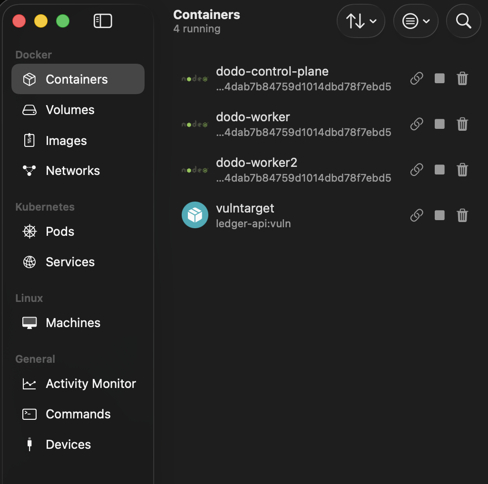
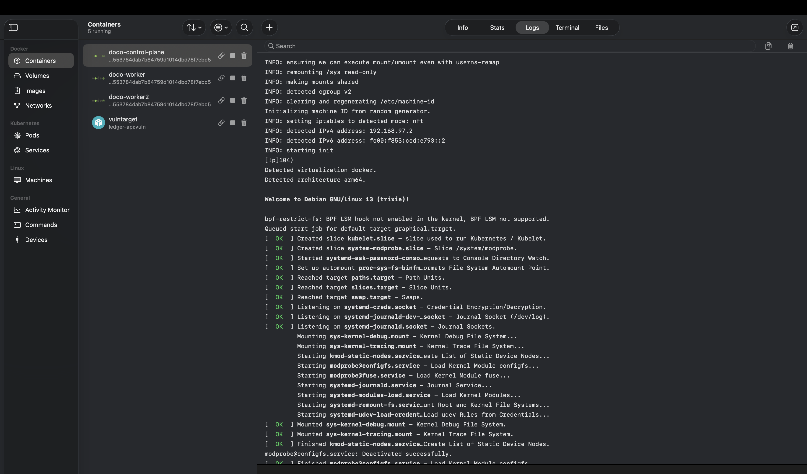

# Task 1 — Deploy & Harden the Workload

Turn `ledger-api` from the insecure starter into a production-grade, PCI-aware
workload on a local **kind** cluster, with **admission guardrails** that make
the insecure version impossible to deploy again.

> The application code itself is also hardened (see [`../app`](../app) and
> [Task 4](../task4-recon-pentest) for the before/after). Task 1 is about the
> *workload / platform* controls below.

## 🎬 Demo (terminal recording)


## 📸 The cluster is real (OrbStack)

kind nodes running as containers in OrbStack, and a kind node's boot log (arm64):




---

## What was wrong in the starter

| # | Issue (starter) | Fix (this task) |
|---|-----------------|-----------------|
| 1 | Runs as **root**, no `securityContext` | non-root uid 10001, `readOnlyRootFilesystem`, drop **ALL** caps, `allowPrivilegeEscalation:false`, seccomp `RuntimeDefault` |
| 2 | **Plaintext secrets** in `deployment.yaml` (`sk_live_…`, `P@ssw0rd123`) | **Sealed Secrets** — only ciphertext in git; controller unseals into a `Secret`; pod reads via `secretKeyRef` |
| 3 | No resource requests/limits | requests + limits on every container |
| 4 | No liveness/readiness probes | `httpGet /health` probes on ledger-api; exec probes on neighbour |
| 5 | Uses **default ServiceAccount**, token auto-mounted | dedicated `ledger-api` SA, **zero RBAC**, `automountServiceAccountToken:false` |
| 6 | Mutable `:starter` tag, unsigned | pinned tag; Kyverno rejects `:latest`/untagged and **unsigned** ghcr images |
| 7 | No network/admission guardrails | **PSS restricted** namespace + **Kyverno** ClusterPolicies (Enforce) |
| 8 | No Ingress, single Deployment | Deployment + Service + ConfigMap + **Ingress** + a **neighbour** service |

---

## Layout

```
task1-harden-workload/
├── cluster/kind-config.yaml         # 3-node kind cluster, ingress port-maps
├── manifests/                       # applied in name order (00→40)
│   ├── 00-namespace.yaml            # PSS restricted labels + pci-scope=cde
│   ├── 10-configmap.yaml            # non-secret config
│   ├── 20-serviceaccount.yaml       # ledger-api SA, no token, no RBAC
│   ├── 21-rbac-reporting.yaml       # neighbour SA + least-priv Role (no secrets)
│   ├── 30-deployment.yaml           # the hardened ledger-api
│   ├── 31-service.yaml
│   ├── 32-ingress.yaml
│   ├── 33-neighbour.yaml            # reporting client (also PSS-restricted)
│   └── 40-sealed-secret.yaml        # ENCRYPTED — safe to commit
├── policies/                        # Kyverno ClusterPolicies (Enforce)
│   ├── disallow-root.yaml
│   ├── disallow-latest-tag.yaml
│   └── require-signed-images.yaml   # cosign keyless, scoped to ghcr image path
├── rbac-personas/personas.yaml      # dev / operator / admin (bonus)
│   └── RBAC-MATRIX.txt              # captured can-i matrix
└── insecure-original/               # the starter Deployment + its REJECTION-OUTPUT.txt
```

## Reproduce

```bash
# 0. cluster + controllers (one-time)
kind create cluster --name dodo --config cluster/kind-config.yaml
helm upgrade --install kyverno kyverno/kyverno -n kyverno --create-namespace --wait
kubectl apply -f https://github.com/bitnami-labs/sealed-secrets/releases/download/v0.38.4/controller.yaml
kubectl apply -f https://raw.githubusercontent.com/kubernetes/ingress-nginx/main/deploy/static/provider/kind/deploy.yaml

# 1. build + load the hardened image
docker build -t ledger-api:0.1.0 ../app && kind load docker-image ledger-api:0.1.0 --name dodo

# 2. (re)generate the SealedSecret — plaintext is piped, never written to disk/git
kubectl create secret generic ledger-api-secrets -n payments \
  --from-literal=STRIPE_API_KEY=sk_test_xxx --from-literal=DB_PASSWORD="$(openssl rand -base64 18)" \
  --from-literal=LEDGER_API_TOKEN="$(openssl rand -hex 24)" --from-literal=TOKEN_SALT="$(openssl rand -hex 16)" \
  --dry-run=client -o yaml | kubeseal --controller-name sealed-secrets-controller \
  --controller-namespace kube-system --format yaml > manifests/40-sealed-secret.yaml

# 3. policies + workload
kubectl apply -f policies/
kubectl apply -f manifests/
kubectl apply -f rbac-personas/personas.yaml
```

---

## Design decisions & trade-offs

**Secrets — why Sealed Secrets.** Fully local, GitOps-native (the encrypted
`SealedSecret` is the source of truth in git and ArgoCD applies it directly),
and the private key never leaves the cluster. Asymmetric crypto means anyone
can *seal*, only the controller can *unseal*. SOPS+age needs a decrypting
plugin in ArgoCD; External Secrets needs a backend store to stand up — more
moving parts for the same "no plaintext in git" outcome. The rotation story:
re-seal against the controller cert; to rotate the *data key* you rotate the
controller key and re-seal.

**RBAC — least privilege means "nothing" for the app.** `ledger-api` is a
stateless HTTP service that never calls the Kubernetes API, so the correct
least-privilege posture is **no RBAC at all** *and* no mounted token — this
removes an entire lateral-movement path (a popped pod can't reach the API
server). The neighbour `reporting` service *does* use the API (service
discovery + its ConfigMap), so it gets a tightly scoped namespaced `Role`
that can read services/endpoints and exactly one ConfigMap by name — and
**explicitly not secrets**.

**Two admission layers on purpose.** PSS `restricted` is the fast, built-in
baseline enforced by the kube-apiserver. Kyverno adds *named, auditable*
policies (`disallow-run-as-root`, `disallow-latest-tag`,
`require-signed-images`) with clear rejection messages and covers things PSS
doesn't (image tags, signatures). Defence in depth: the insecure Deployment is
caught by whichever layer fires first.

**Signed-image policy is scoped.** `require-signed-images` matches only
`ghcr.io/<owner>/ledger-api*` and verifies a **cosign keyless** signature from
this repo's GitHub Actions OIDC identity (Task 2). The locally-built
`ledger-api:0.1.0` is out of scope so the kind demo runs, while every image
pulled from the registry in a real cluster is gated.

---

## Verification (all captured live)

**Hardened container securityContext**
```json
{ "allowPrivilegeEscalation": false, "capabilities": {"drop":["ALL"]},
  "privileged": false, "readOnlyRootFilesystem": true,
  "runAsNonRoot": true, "runAsUser": 10001,
  "seccompProfile": {"type":"RuntimeDefault"} }
```

**Secret is encrypted in git, unsealed in-cluster** — `manifests/40-sealed-secret.yaml`
contains only `encryptedData` ciphertext; `kubectl get secret ledger-api-secrets`
exists only after the controller unseals it; the Deployment references it via
`secretKeyRef` (no inline values).

**Least privilege**
```
can-i get secrets  (ledger-api SA) -> no
can-i get secrets  (reporting SA)  -> no
can-i list services (reporting SA) -> yes
```

**API auth + PAN masking** — `/transactions` returns `401` without a bearer
token; with the token PANs are masked to `424242******4242` (PCI first6/last4).

**Admission rejects the insecure Deployment** (`insecure-original/REJECTION-OUTPUT.txt`)
— blocked by **both** PSS restricted and Kyverno `disallow-run-as-root`;
nothing is created.

**Persona RBAC matrix** (`rbac-personas/RBAC-MATRIX.txt`)
```
action              dev   operator  admin
delete pods         no    yes       yes
scale/patch deploy  no    yes       yes
READ SECRETS        no    no        yes
modify RBAC         no    no        yes
```

---

## PCI DSS mapping

| Control here | PCI DSS req |
|---|---|
| No plaintext secrets, encrypted at rest | Req 3 (protect stored data), Req 8/8.6 (secrets) |
| PAN masking on `/transactions` | Req 3.4 (mask PAN, max first6/last4) |
| Namespace = CDE, non-root, dropped caps | Req 2 (secure config), Req 7 (least privilege) |
| Admission guardrails, signed images | Req 6.3 / Req 2 (change control, supply chain) |
| RBAC personas, no shared default SA | Req 7 (need-to-know), Req 8 (unique IDs) |
