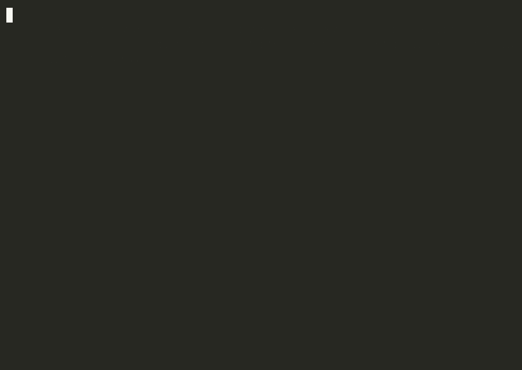
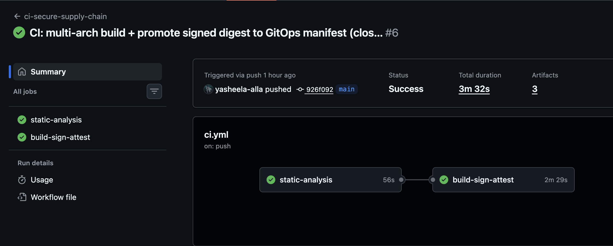
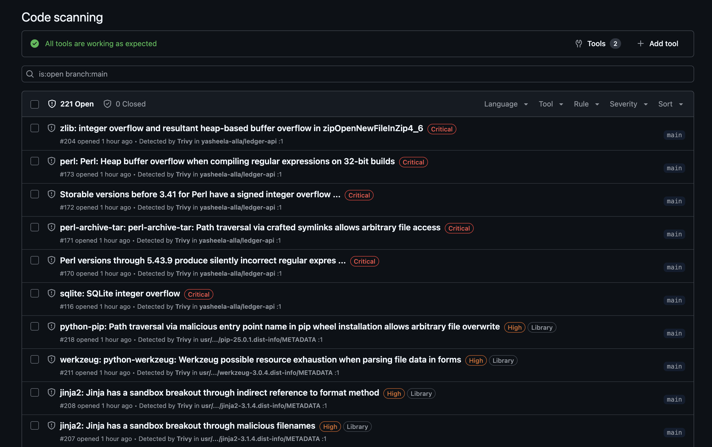
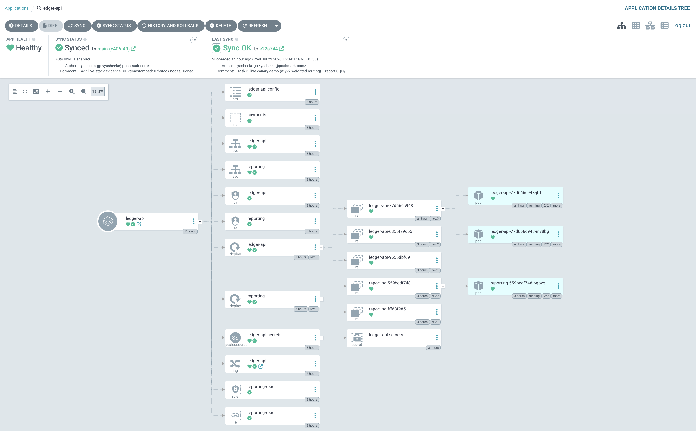

# Task 2 — Secure CI/CD Pipeline & Supply Chain

Security is enforced by the pipeline, not by good intentions. Every image that
reaches the registry has passed secret-scan → SAST → dependency-CVE →
image-scan, and is **cosign-signed (keyless)** with **SLSA provenance** and an
**SBOM attestation**. **ArgoCD** is the deploy source of truth with drift
self-heal.

Pipeline: [`.github/workflows/ci.yml`](../.github/workflows/ci.yml)

## 🎬 Demo (terminal recording) — signed image runs, unsigned rejected



## 📸 Screenshots

**Green pipeline** (multi-arch build → scan → sign → attest → promote):


**SARIF in the Security tab** (Trivy + Semgrep code-scanning alerts):


**ArgoCD — GitOps source of truth (Healthy / Synced), full resource tree:**


```
 push ─▶ static-analysis ───────────────▶ build-sign-attest ───────────────▶ GitOps (ArgoCD)
         ├─ gitleaks   (secrets)          ├─ docker build (load, no push)      ├─ auto-sync
         ├─ semgrep    (SAST)      SARIF  ├─ trivy image scan        SARIF     ├─ self-heal
         └─ trivy fs   (deps CVE)  SARIF  ├─ push (digest) ─▶ GHCR             └─ prune
                                          ├─ cosign sign (keyless, Rekor)
                                          ├─ cosign attest SBOM (spdx)
                                          ├─ SLSA build provenance
                                          └─ cosign verify (proof)
```

---

## Gate fail policy

| Gate | Tool | Hard-blocks on | Warns (non-blocking) | Rationale |
|------|------|----------------|----------------------|-----------|
| Secrets | **gitleaks** | any committed secret | — | a leaked key is game-over; zero tolerance, full history scanned |
| SAST | **Semgrep** | `ERROR` severity | `WARNING`/`INFO` | ERROR = likely exploitable (e.g. `yaml.load`, SSRF sink); noise shouldn't block delivery |
| Deps CVE | **Trivy fs** | **fixable** `CRITICAL`/`HIGH` | unfixable + `MEDIUM`/`LOW` | if a fix exists there's no excuse; block. Full SARIF still uploaded for visibility |
| Image | **Trivy image** | **fixable** `CRITICAL`/`HIGH` | unfixable + lower | same policy applied to the built artifact incl. OS packages |
| Signing | **cosign** | signature/attest step failing | — | an unsigned image must never be publishable |

### How we handle a CVE with no fix yet

`ignore-unfixed: true` on the **gating** scans, so an unfixable CVE does **not**
block delivery (there is nothing to upgrade to). But it is **not ignored**:

1. A second, non-gating Trivy run uploads the **full** SARIF (incl. unfixable +
   MEDIUM) to the repo's Security tab, so it's tracked and visible.
2. The residual risk is triaged against the layered controls from Tasks 1 & 3
   (read-only rootfs, dropped caps, non-root, egress NetworkPolicy, mTLS) — is
   the vulnerable code path even reachable/exploitable in our deployment?
3. If accepted, it gets a `.trivyignore` entry with an expiry date and a linked
   ticket; re-triaged when a fix ships.

This is exactly the situation for the hardened app today: **0 fixable
CRITICAL/HIGH**, a handful of MEDIUM advisories on pinned deps that are tracked
but don't gate. (Contrast the original: 3 CRITICAL + 9 HIGH — see
`scan-evidence/trivy-original-FAIL.txt`, including PyYAML **CVE-2019-20477**,
"command execution through python/object/apply" — the exact RCE proven in Task 4.)

---

## Signing & provenance (keyless)

No long-lived keys. In the GitHub Actions run, `id-token: write` mints an OIDC
token; cosign exchanges it with **Fulcio** for a short-lived cert bound to the
workflow identity, signs the image **by digest**, and records the signature in
the **Rekor** transparency log. Verification checks the cert identity, not a key:

```bash
cosign verify \
  --certificate-identity-regexp "https://github.com/yasheela-alla/dodo-payments-devsecops/.github/workflows/.*" \
  --certificate-oidc-issuer "https://token.actions.githubusercontent.com" \
  ghcr.io/yasheela-alla/ledger-api@sha256:<digest>
```

This is the **same identity** the Task 1 Kyverno `require-signed-images` policy
enforces at admission — the cluster will only run images this pipeline signed.
Two attestations are attached: an **SBOM** (SPDX) and **SLSA build provenance**
(`actions/attest-build-provenance`).

---

## GitOps with ArgoCD — drift detection & self-heal

[`argocd/application.yaml`](argocd/application.yaml) sets
`syncPolicy.automated: { selfHeal: true, prune: true }`. Git is the desired
state; anything applied by hand that diverges is reverted.

```bash
./argocd/setup.sh          # install + register the Application
./drift-demo.sh            # scale by hand -> ArgoCD reverts to git (replicas=2)
```

`drift-demo.sh` scales the Deployment to 5 replicas with `kubectl` (drift),
ArgoCD marks the app `OutOfSync`, and self-heal restores it to the git-declared
`replicas: 2` — proving manual changes cannot persist.

---

## Bonus delivered

- **SARIF → Security tab** — Semgrep + both Trivy scans upload via
  `github/codeql-action/upload-sarif` (distinct `category:` per tool).
- **`cosign verify` proof** — run in-pipeline and saved as the `cosign-verify`
  artifact; verification output also shown above.
- **Progressive delivery** — canary is implemented with Istio
  `VirtualService`/`DestinationRule` in [Task 3](../task3-istio-zero-trust);
  a blue-green variant is described there. (Chosen over Argo Rollouts to avoid a
  second controller and to keep traffic-shifting at the mesh layer.)

## Live run (proof)

- **Green pipeline:** https://github.com/yasheela-alla/dodo-payments-devsecops/actions/runs/30438516596
- **Signed image:** https://github.com/yasheela-alla/dodo-payments-devsecops/pkgs/container/ledger-api
- **`cosign verify` output:** [`proof/cosign-verify.txt`](proof/cosign-verify.txt) — signature validated against the workflow OIDC identity + Rekor transparency log:
  ```
  Verification for ghcr.io/yasheela-alla/ledger-api:latest-signed --
    - The cosign claims were validated
    - Existence of the claims in the transparency log was verified offline
    - The code-signing certificate was verified using trusted certificate authority certificates
  Subject:  https://github.com/yasheela-alla/dodo-payments-devsecops/.github/workflows/ci.yml@refs/heads/main
  Issuer:   https://token.actions.githubusercontent.com
  ```
- **SARIF in the Security tab:** three categories uploaded — `semgrep`, `trivy-deps`, `trivy-image`.
- **GitOps drift/self-heal:** [`argocd/DRIFT-SELFHEAL-PROOF.txt`](argocd/DRIFT-SELFHEAL-PROOF.txt) — a manual `kubectl scale` to 5 was reverted to the git-declared 2 within ~10s.

### Closed loop: CI signs → GitOps deploys → admission verifies

The pipeline is multi-arch and **promotes the signed digest back into git**, so
ArgoCD deploys *exactly* the image CI signed, and the Task-1 Kyverno
`require-signed-images` policy verifies its signature at admission. Full proof:
[`proof/SIGNED-IMAGE-ADMISSION-PROOF.txt`](proof/SIGNED-IMAGE-ADMISSION-PROOF.txt).

```
CI  ──sign(keyless)──▶ ghcr.io/.../ledger-api@sha256:d642d2af…
    ──promote────────▶ git commit "ci: promote signed image … [skip ci]"  (be8bb76)
ArgoCD ──sync────────▶ Deployment image = @sha256:d642d2af…  (Synced/Healthy)
Kyverno verifyImages ▶ POSITIVE: pod annotated
                       kyverno.io/verify-images: {"…@sha256:d642d2af…":"pass"}
                     ▶ NEGATIVE: unsigned busybox blocked —
                       "failed to verify image … keyless: no signatures found"
```
Only images signed by this repo's workflow identity can run in the cluster.

> The pipeline runs entirely on GitHub's free runners against GHCR — no cloud
> account. Local reproductions of every gate are in `scan-evidence/`.
